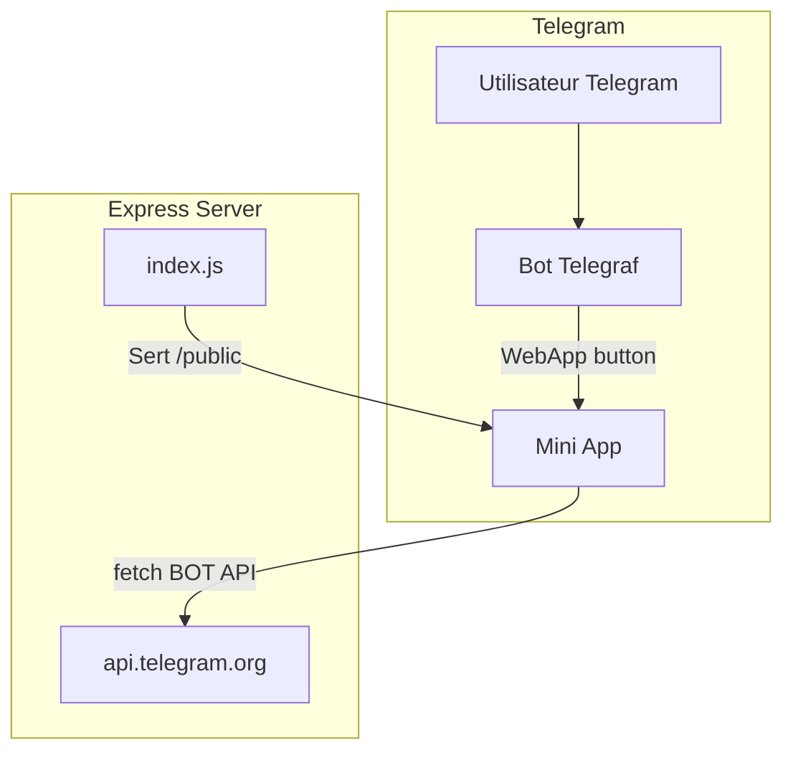

# Evodevs Team — Telegram Mini App

## Overview

Création d'une Mini App Telegram complète pour **Evodevs Team** : une SPA (Single Page Application) en HTML/CSS/JS vanille avec design glassmorphique argenté, intégrée au bot Telegram existant via le Telegram Web App SDK.

## Architecture

---

## Proposed Changes

### 1. Backend — Serveur Express + Bot

#### [MODIFY] [index.js](file:///home/cyd/Documents/EvoBot/index.js)

- Ajouter `express.static('public')` pour servir les fichiers de la Mini App
- Ajouter une route `/api/send-order` comme proxy pour envoyer les commandes via le Bot API (évite d'exposer le BOT_TOKEN côté client)
- Mettre à jour la commande `/start` du bot pour inclure un bouton **"Ouvrir la Mini App"** (`Markup.button.webApp`)
- Conserver le serveur de monitoring existant

---

### 2. Frontend — Mini App SPA

Tous les fichiers frontend seront dans le dossier `/public`.

#### [NEW] [public/index.html](file:///home/cyd/Documents/EvoBot/public/index.html)

- Document HTML5 avec meta viewport mobile-first
- Intégration du Telegram Web App SDK (`telegram-web-app.js`)
- Google Fonts : Inter
- Lucide Icons CDN
- Structure : `#app` container avec les 4 pages + bottom nav + modals

#### [NEW] [public/styles.css](file:///home/cyd/Documents/EvoBot/public/styles.css)

Design system complet :
- **Variables CSS** : palette argentée (#C0C0C0, #A8A8A8, #E8E8E8, #2C2C2C, #1A1A1A), border-radius 16-24px, transitions
- **Fond** : dégradé #0f0f0f → #1c1c1e avec effet mesh/particules CSS
- **Glassmorphisme** : backdrop-filter: blur(20px), bordures semi-transparentes, box-shadow douce
- **Animations** : keyframes fade-in/slide-up, staggered delays, typewriter, counter, ripple effect
- **Composants** : cards, chips, buttons, bottom-nav, modals, forms, spinners
- **Responsive** : grille 2 colonnes services, mobile-first

#### [NEW] [public/app.js](file:///home/cyd/Documents/EvoBot/public/app.js)

SPA JavaScript vanille :
- **Router** : navigation par hash ou état interne, transitions fluides entre pages
- **Pages** :
  - `renderHome()` : hero + slogan typewriter + stats animées + CTA
  - `renderServices()` : grille de cartes services avec prix
  - `renderServiceDetail(id)` : modal/page détaillée avec features, tarifs, bouton commander
  - `renderPolicy()` : texte structuré défilable
  - `renderAbout()` : présentation équipe + stack tech + stats
- **Formulaire de commande** : modal glassmorphique, validation, envoi via `/api/send-order`
- **Animations** : IntersectionObserver pour les entrées, compteurs animés, ripple sur boutons
- **Telegram SDK** : `Telegram.WebApp.ready()`, thème, back button, haptic feedback

---

## Configuration Technique

> [!IMPORTANT]
> **Variables d'environnement requises** (à configurer sur Render ou en local) :
> - `BOT_TOKEN` — Token du bot Telegram (déjà existant)
> - `OWNER_CHAT_ID` — Chat ID du propriétaire pour recevoir les commandes
> - `WEBAPP_URL` — URL publique de la Mini App (ex: `https://evobot-xxxx.onrender.com`)

## User Review Required

> [!IMPORTANT]
> **OWNER_CHAT_ID** : Quel est le chat_id Telegram du propriétaire qui recevra les notifications de commande ?

> [!IMPORTANT]
> **WEBAPP_URL** : Quelle est l'URL de déploiement (Render) pour configurer le bouton WebApp du bot ?

> [!NOTE]
> Le BOT_TOKEN est actuellement en dur dans le code (`8203109380:AAG...`). Pour la sécurité en production, il sera utilisé uniquement côté serveur via la variable d'environnement `BOT_TOKEN`. Le proxy `/api/send-order` évite d'exposer le token dans le frontend.

## Verification Plan

### Automated Tests
- Lancer `node index.js` localement et vérifier que le serveur sert la Mini App sur `http://localhost:3000`
- Tester l'endpoint `/api/send-order` avec curl
- Vérifier le rendu dans le navigateur (responsive mobile)

### Manual Verification
- Ouvrir la Mini App dans le navigateur pour vérifier les animations, la navigation, et le glassmorphisme
- Tester le formulaire de commande end-to-end
